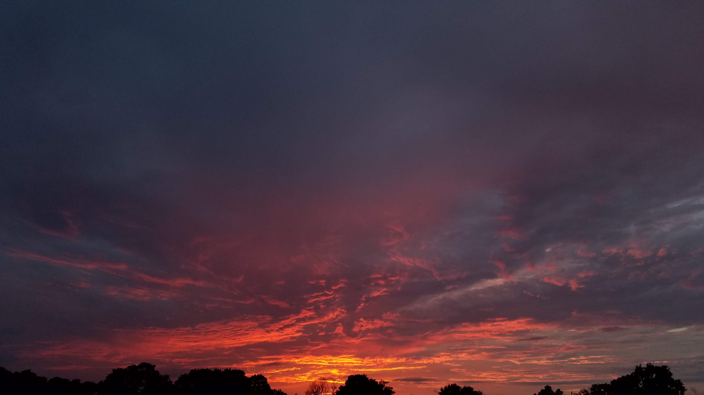

# A Practical Demonstration of reproducible research #
## Markdown, R, Knitr ##
### Using EPA and Department of State (DOS) air quality data ###
* September 7, 2018
* Erik Beck and Emily Li
* For presentation at R Workshop
* EPA, RTP, September 11, 2018

# Disclaimers #

## Data Disclaimer ##

Much of the data used for this demonstration, and in particular the US
Embassy air data and the 2018 domestic data, is provisional and should
not be used for any final policy discussions or decisions.

## Opinion Disclaimer ##

Any opinions expressed herein are those of the author(s), and are not
reflective of EPA, Department of State, foreign governments, state
governments or anyone else's position; implied, expressed, explicit,
implicit, or otherwise.

## Error Disclaimer ##

All errors are Erik's fault.

# A little background... #

## Policy Background ##
### According to NYS Department of Health: ###

#### Fine Particles (PM 2.5) Questions and Answers ####
* Fine particulate matter (PM2.5) is an air pollutant that is a
concern for people's health when levels in air are high.

* PM2.5 are tiny particles in the air that reduce visibility and cause
the air to appear hazy when levels are elevated.

* Outdoor PM2.5 levels are most likely to be elevated on days with
little or no wind or air mixing.

### How can PM2.5 affect my health? ###

* Particles in the PM2.5 size range are able to travel deeply into the
respiratory tract, reaching the lungs. Exposure to fine particles can
cause short-term health effects such as eye, nose, throat and lung
irritation, coughing, sneezing, runny nose and shortness of
breath. Exposure to fine particles can also affect lung function and
worsen medical conditions such as asthma and heart disease.

### Where does PM2.5 come from? ###

* There are outdoor and indoor sources of fine particles. Outside, fine
particles primarily come from car, truck, bus and off-road vehicle
(e.g., construction equipment, snowmobile, locomotive) exhausts, other
operations that involve the burning of fuels such as wood, heating oil
or coal and natural sources such as forest and grass fires. Fine
particles also form from the reaction of gases or droplets in the
atmosphere from sources such as power plants. These chemical reactions
can occur miles from the original source of the emissions. In New York
State, some of the fine particles measured in the air are carried by
wind from out-of-state sources. Because fine particles can be carried
long distances from their source, events such as wildfires or volcanic
eruptions can raise fine particle concentrations hundreds of miles
from the event.

* PM2.5 is also produced by common indoor activities. Some indoor
sources of fine particles are tobacco smoke, cooking (e.g., frying,
sautéing, and broiling), burning candles or oil lamps, and operating
fireplaces and fuel-burning space heaters (e.g., kerosene heaters).

* (Abridged info from NYSDoH)
* https://www.health.ny.gov/environmental/indoors/air/pmq_a.htm

{Insert photo here}





## Erik and Air ##

* Erik has some (ancient) background in air policy, but in ozone, NOx,
  and SOx in Region 9. In the 1990's. In other words, he isn't an expert.

## Data Background and sources ##
* EPA: (Most USA Data) https://aqs.epa.gov/aqsweb/airdata/download_files.html
* EPA: (2018 USA Data) https://www.airnowtech.org/ 
* Dept. of State (DOS): (China) http://www.stateair.net/web/historical/1/1.html
* DOS/EPA: (All) https://airnow.gov/index.cfm?action=airnow.global_summary

# On with the show... #


```{r}
summary(cars$dist)
summary(cars$speed)
```

https://rmarkdown.rstudio.com/authoring_basics.html
