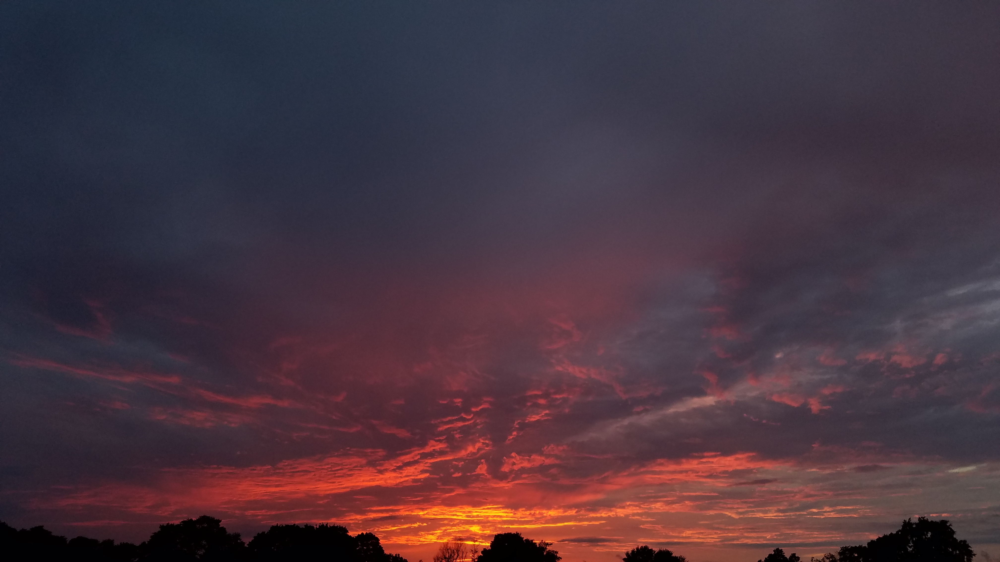

---
output:
  pdf_document: default
---
# A Practical Demonstration of reproducible research #
## Markdown, R, Knitr ##
### Using EPA and Department of State (DOS) air quality data ###
* August 11, 2019
* Erik Beck and Emily Li
* For presentation at R Workshop
* EPA, RTP, August 13, 2019

# Disclaimers #

## Data Disclaimer ##

Much of the data used for this demonstration, and in particular the US
Embassy air data and the 2018 domestic data, is provisional and should
not be used for any final policy discussions or decisions.

## Opinion Disclaimer ##

Any opinions expressed herein are those of the author(s), and are not
reflective of EPA, Department of State, foreign governments, state
governments or anyone else's position; implied, expressed, explicit,
implicit, or otherwise.

## Error Disclaimer ##

All errors are Erik's fault.

# A little background... #

## Policy Background ##
### According to NYS Department of Health: ###

#### Fine Particles (PM 2.5) Questions and Answers ####
* Fine particulate matter (PM2.5) is an air pollutant that is a
concern for people's health when levels in air are high.

* PM2.5 are tiny particles in the air that reduce visibility and cause
the air to appear hazy when levels are elevated.

* Outdoor PM2.5 levels are most likely to be elevated on days with
little or no wind or air mixing.

### How can PM2.5 affect my health? ###

* Particles in the PM2.5 size range are able to travel deeply into the
respiratory tract, reaching the lungs. Exposure to fine particles can
cause short-term health effects such as eye, nose, throat and lung
irritation, coughing, sneezing, runny nose and shortness of
breath. Exposure to fine particles can also affect lung function and
worsen medical conditions such as asthma and heart disease.

### Where does PM2.5 come from? ###

* There are outdoor and indoor sources of fine particles. Outside, fine
particles primarily come from car, truck, bus and off-road vehicle
(e.g., construction equipment, snowmobile, locomotive) exhausts, other
operations that involve the burning of fuels such as wood, heating oil
or coal and natural sources such as forest and grass fires. Fine
particles also form from the reaction of gases or droplets in the
atmosphere from sources such as power plants. These chemical reactions
can occur miles from the original source of the emissions. In New York
State, some of the fine particles measured in the air are carried by
wind from out-of-state sources. Because fine particles can be carried
long distances from their source, events such as wildfires or volcanic
eruptions can raise fine particle concentrations hundreds of miles
from the event.

* PM2.5 is also produced by common indoor activities. Some indoor
sources of fine particles are tobacco smoke, cooking (e.g., frying,
sautéing, and broiling), burning candles or oil lamps, and operating
fireplaces and fuel-burning space heaters (e.g., kerosene heaters).

* (Abridged info from NYSDoH)
* https://www.health.ny.gov/environmental/indoors/air/pmq_a.htm

### Positive impact of PM2.5 ###
It can help make sunsets more spectacular:




## Erik and Air ##

* Erik has some (ancient) background in air policy, but in ozone, NOx,
  and SOx in Region 9. In the 1990's. In other words, he isn't an expert.

## Data Background and sources ##
* EPA: (Most USA Data) https://aqs.epa.gov/aqsweb/airdata/download_files.html
* EPA: (2018 USA Data) https://www.airnowtech.org/ 
* Dept. of State (DOS): (China) http://www.stateair.net/web/historical/1/1.html
* DOS/EPA: (All) https://airnow.gov/index.cfm?action=airnow.global_summary

# On with the show... #

```r
library(lubridate)
```

```
## Warning: package 'lubridate' was built under R version 3.4.4
```

```
## 
## Attaching package: 'lubridate'
```

```
## The following object is masked from 'package:base':
## 
##     date
```

```r
setwd("A:/ReproducibleResearch/Github2019/R-MD-LaTeX/Data/AirQualityData")
```


## Air Quality Around the World ##
Air quality issues are not limited to the United States.  Other countries have issues with poor air quality at times.

Here are some summary statistics for data obtained from the U.S. Embassies at a few overseas locations:

# China #


## Beijing ##
Beijing Air Data, PM2.5; 2008-2017.

### Variables:###
*  [1] "Site"            "Parameter"       "Date_LST"       
*  [4] "Year"            "Month"           "Day"            
*  [7] "Hour"            "Value"           "Unit"           
* [10] "Duration"        "QC_Name"         "SampleLocalTime"
* [13] "SampleUTC"


```r
BeijingAir <- readRDS (file = "Beijing/BeijingPM08_17.rds")
colnames (BeijingAir)
```

```
##  [1] "Site"            "Parameter"       "Date_LST"       
##  [4] "Year"            "Month"           "Day"            
##  [7] "Hour"            "Value"           "Unit"           
## [10] "Duration"        "QC_Name"         "SampleLocalTime"
## [13] "SampleUTC"
```

```r
summary(BeijingAir$Value)
```

```
##    Min. 1st Qu.  Median    Mean 3rd Qu.    Max.    NA's 
##  -15.00   27.00   66.00   91.53  126.00  994.00    4459
```

```r
plot (BeijingAir$SampleUTC, BeijingAir$Value)
```


## ShenYang ##
ShenYang Air Data, PM2.5; 2013-2017.


```r
ShenYang <- readRDS (file = "ShenYang/ShenYang13_17_PM.rds")
colnames (ShenYang)
```

```
##  [1] "Site"            "Parameter"       "Date_LST"       
##  [4] "Year"            "Month"           "Day"            
##  [7] "Hour"            "Value"           "Unit"           
## [10] "Duration"        "QC_Name"         "SampleLocalTime"
## [13] "SampleUTC"
```

```r
summary(ShenYang$Value)
```

```
##    Min. 1st Qu.  Median    Mean 3rd Qu.    Max.    NA's 
##  -15.00   29.00   51.00   69.01   89.00  932.00    5897
```

```r
plot (ShenYang$SampleUTC, ShenYang$Value)
```


# India #

## Kolkata (Calcutta) ##
Kolkata Air Data, PM2.5; 2015-2018.

```r
Kolkata <- readRDS (file = "Calcutta/Kolkata_15_18pm.rds")
colnames (Kolkata)
```

```
##  [1] "Site"            "Parameter"       "Date_LT"        
##  [4] "Year"            "Month"           "Day"            
##  [7] "Hour"            "NowCast"         "AQI"            
## [10] "AQI_Category"    "RawConc"         "ConcUnit"       
## [13] "Duration"        "QC_Name"         "SampleLocalTime"
## [16] "SampleUTC"
```

```r
summary (Kolkata$RawConc)
```

```
##    Min. 1st Qu.  Median    Mean 3rd Qu.    Max.    NA's 
##  -15.00   27.00   47.00   77.01  101.00  997.00    3059
```

```r
plot (Kolkata$SampleUTC, Kolkata$RawConc)
```


# USA #

## Pacific Northwest ##

### 1999-2017 ###
PM 2.5; Washington, Oregon, Idaho, Montana


```r
Montana17      <- readRDS (file = "USA/PNW/MontanaPM25.rds")
Washington17   <- readRDS (file = "USA/PNW/WashingtonPM25.rds")
Oregon17       <- readRDS (file = "USA/PNW/OregonPM25.rds")
Idaho17	       <- readRDS (file = "USA/PNW/IdahoPM25.rds")
PNW17 	       <- readRDS (file = "USA/PNW/PNW_PM25.rds")

colnames(PNW17)
```

```
## [1] "State.Code"      "Site.Num"        "Latitude"        "Longitude"      
## [5] "Parameter.Name"  "Date"            "Arithmetic.Mean" "State.Name"     
## [9] "City.Name"
```

```r
summary(PNW17$Arithmetic.Mean)
```

```
##    Min. 1st Qu.  Median    Mean 3rd Qu.    Max. 
##  -4.900   3.875   6.200   8.816  10.300 330.000
```

```r
plot(PNW17$Date, PNW17$Arithmetic.Mean)
```

-1.png)

# Joys of Reproducible Research and Batch/Scripting #

If we need to update the report with new data (or fix errors like I
did in preparing this document), it is easy to merely re-run the
script with the needed changes.

## Pacific Northwest (redux)
PM 2.5; Washington, Oregon, Idaho, Montana

### 2018 ###
Note: this is preliminary and provisional data. 


```r
Montana18      <- readRDS (file = "USA/PNW/2018NorthWestUSA/Montana2018.rds")
WaOrId18       <- readRDS (file = "USA/PNW/2018NorthWestUSA/WaOrId2018.rds")
PNW18	         <- readRDS (file = "USA/PNW/2018NorthWestUSA/PNW18.rds")
colnames (PNW18)
```

```
## [1] "dummy"     "State"     "Date"      "PM25value" "SiteName"
```

```r
summary(PNW18)
```

```
##      dummy              State                Date                    
##  Min.   :-4.155487   Length:43941       Min.   :2018-01-01 00:00:00  
##  1st Qu.:-0.680843   Class :character   1st Qu.:2018-03-29 00:00:00  
##  Median : 0.002940   Mode  :character   Median :2018-06-11 00:00:00  
##  Mean   : 0.000476                      Mean   :2018-05-24 11:39:54  
##  3rd Qu.: 0.670331                      3rd Qu.:2018-07-22 00:00:00  
##  Max.   : 4.318832                      Max.   :2018-08-28 00:00:00  
##                                                                      
##    PM25value                             SiteName    
##  Min.   : -4.900   Anacortes-202 Ave (SO-AQS):  331  
##  1st Qu.:  2.900   Bellevue-SE 12th          :  331  
##  Median :  4.900   Boundary County           :  331  
##  Mean   :  9.855   Cheeka Peak               :  331  
##  3rd Qu.:  8.600   Chehalis-Market Blvd      :  331  
##  Max.   :663.300   Colville-E 1st St         :  331  
##  NA's   :155       (Other)                   :41955
```

```r
plot (PNW18$Date, PNW18$PM25value)
```


# Handy Reference for R's extentions to Markdown #
* https://rmarkdown.rstudio.com/authoring_basics.html
